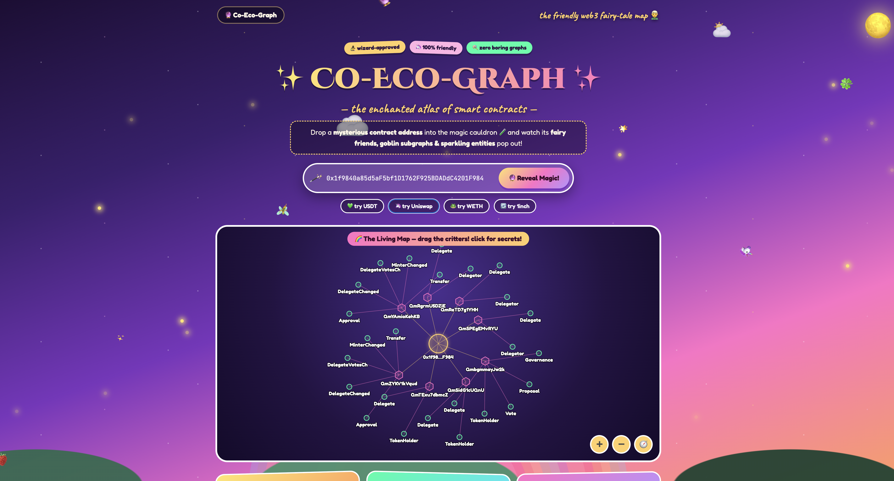

# ✨ Co-Eco-Graph

Discover how a smart contract is used across the indexed Web3 ecosystem.

Paste any contract address and watch its subgraph ecosystem come alive — entities, data sources, event handlers, and AI-powered interpretation, all in one interactive graph.



## ETHOnline 2026 — The Graph Prize

This project is built for [ETHOnline 2026](https://ethglobal.com/events/ethonline2026).

### Key integrations with The Graph

- Queries the **Graph Network Subgraph** to discover subgraph deployments indexing a contract — see [`src/discovery/discovery.ts`](src/discovery/discovery.ts)
- Fetches **subgraph manifests** from IPFS (inline or by ipfsHash) — see [`src/manifest/manifest.ts`](src/manifest/manifest.ts)
- Parses **GraphQL schemas** from IPFS to extract entities and fields

> **ℹ️ All data comes exclusively from The Graph** 

## Quick Start

```bash
npm install
cp .env.example .env
# Fill in your API keys in .env
npm run dev
```

Then open http://localhost:5173

### Run API locally (optional, for development)

```bash
npm run dev:api
```

This starts the analyze endpoint at http://localhost:3001/api/analyze

> **Ports:** Frontend runs on **5173** (Vite), API server on **3001**. Vite proxies `/api` requests to the API server automatically.

## Deploy to Vercel

This project is configured for one-click deployment to Vercel:

[](https://vercel.com/new/clone?repository-url=https://github.com/alekcangp/ceg)

## How It Works

1. Enter a smart contract address
2. The app searches The Graph's decentralized network for subgraphs that index that contract
3. It retrieves and parses the top subgraphs.
4. It extracts data sources, event handlers, entities, and fields from sunbgraph`s manifest
5. It retrieves and parses GraphQL schemas from IPFS
6. It sends one compact dataset to Pollinations API (`POST /v1/chat/completions`) for semantic interpretation
7. It generates a fantasy illustration via Pollinations API (`POST /v1/images/generations`)

## Architecture

- **Frontend**: Vanilla TypeScript + SVG graph (no framework)
- **Backend**: Vercel serverless functions (`api/analyze.ts`)
- **AI (text)**: Pollinations `POST /v1/chat/completions` (OpenAI-compatible)
- **AI (image)**: Pollinations `POST /v1/images/generations` (OpenAI-compatible)
- **Data sources**: The Graph decentralized network, IPFS

## Configuration

All tunables (AI models, gateways, The Graph network subgraph id, limits) live in **[`src/config.ts`](src/config.ts)** 


| Variable | Required | Description |
|---|---|---|
| `THEGRAPH_API_KEY` | Yes | [Get API key](https://thegraph.com/en/) |
| `POLLINATIONS_API_KEY` | No | [Get API key](https://enter.pollinations.ai/keys) — enables AI analysis & image generation |

> **Note**: AI analysis is optional. If Pollinations API key or model is not configured, the app still performs full subgraph discovery, manifest/schema parsing, and graph visualization — just without AI interpretation.


